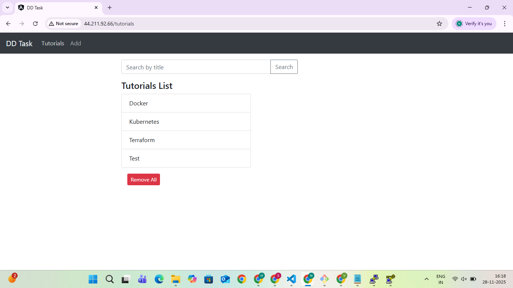
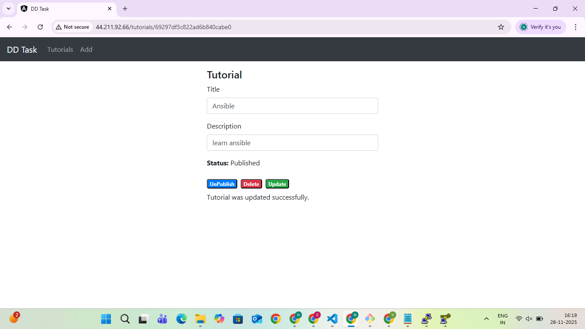
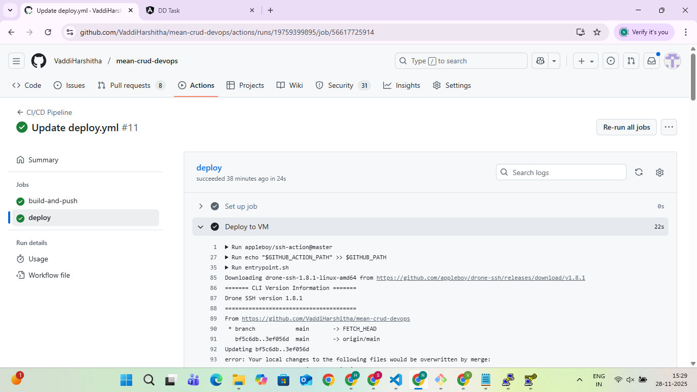
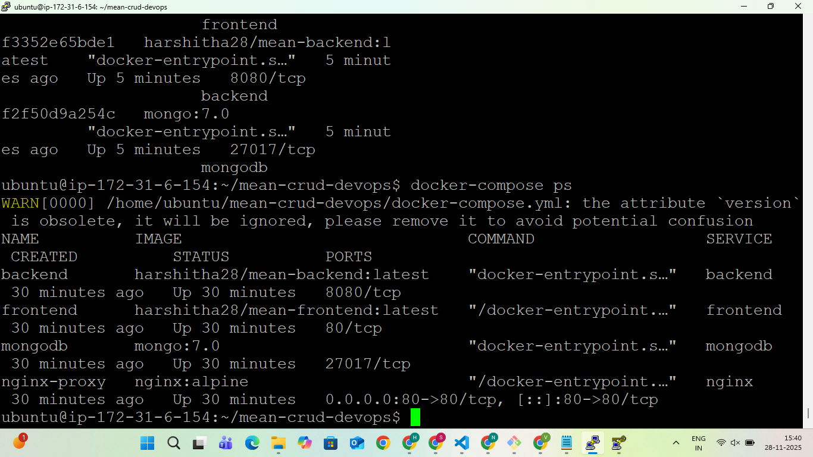
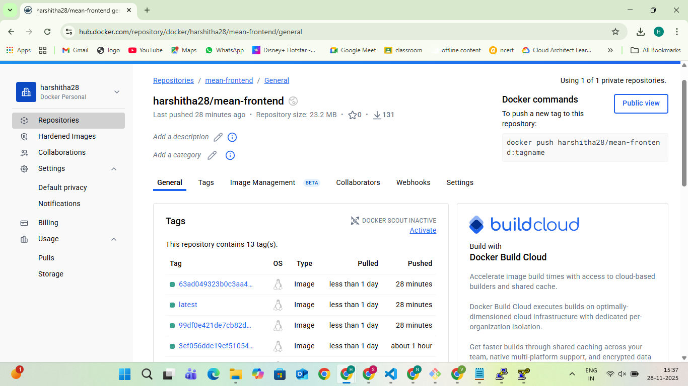
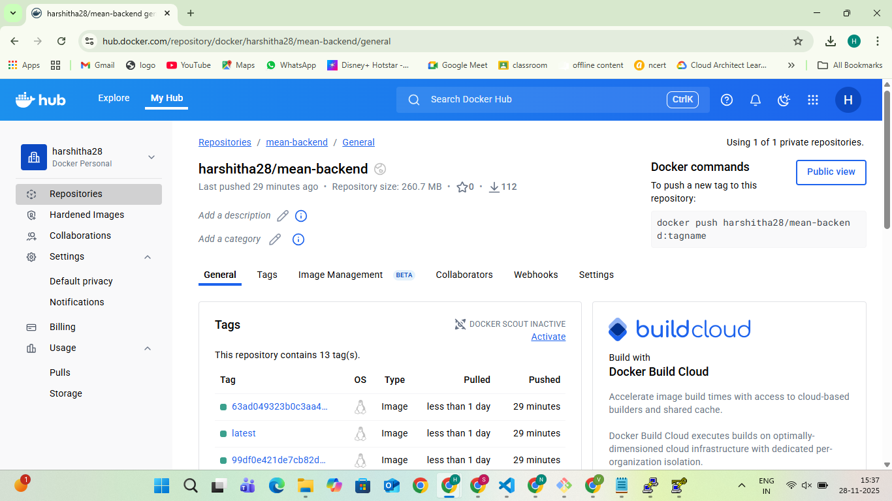
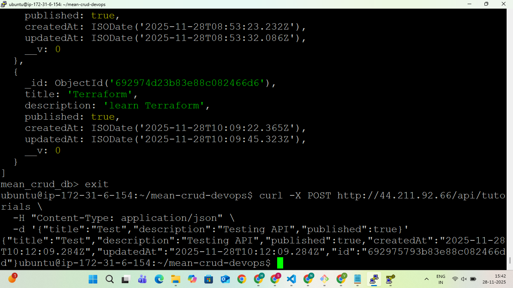

## Mean-crud-devops-tutorial

### Live Deployment
- **Application URL**: http://44.211.92.66
- **Status**: Operational
- **Deployment Date**: November 28, 2024

### GitHub Repository
- **URL**: https://github.com/VaddiHarshitha/mean-crud-devops
- **Branch**: main
- **CI/CD**: Automated with GitHub Actions

### Docker Hub
- **Backend Image**: https://hub.docker.com/r/harshitha28/mean-backend
- **Frontend Image**: https://hub.docker.com/r/harshitha28/mean-frontend

### Technology Stack
- **Frontend**: Angular 15
- **Backend**: Node.js 18, Express.js
- **Database**: MongoDB 7.0
- **Containerization**: Docker, Docker Compose
- **Reverse Proxy**: Nginx
- **CI/CD**: GitHub Actions
- **Cloud Platform**: AWS EC2 (Ubuntu 22.04)


### Project Structure
```
mean-crud-devops/
├── backend/
│   ├── app/
│   │   ├── config/
│   │   ├── controllers/
│   │   ├── models/
│   │   └── routes/
│   ├── Dockerfile
│   ├── package.json
│   └── server.js
├── frontend/
│   ├── src/
│   ├── Dockerfile
│   ├── nginx.conf
│   └── package.json
├── nginx/
│   └── nginx.conf
├── .github/
│   └── workflows/
│       └── deploy.yml
├── docker-compose.yml
└── README.md
```

### Deployment Process
1. Developer pushes code to GitHub (main branch)
2. GitHub Actions triggers automatically
3. Docker images built and pushed to Docker Hub
4. SSH connection established to AWS EC2
5. Latest images pulled on the server
6. Containers restarted with new images
7. Application live at http://44.211.92.66

### Testing the Application

#### Access the Application
```bash
# Open in browser
http://44.211.92.66
```

#### Test API Endpoints
```bash
# Get all tutorials
curl http://44.211.92.66/api/tutorials

# Create a tutorial
curl -X POST http://44.211.92.66/api/tutorials \
  -H "Content-Type: application/json" \
  -d '{"title":"Test","description":"Testing API","published":true}'

# Get tutorial by ID
curl http://44.211.92.66/api/tutorials/{id}

# Update tutorial
curl -X PUT http://44.211.92.66/api/tutorials/{id} \
  -H "Content-Type: application/json" \
  -d '{"title":"Updated","description":"Updated description","published":true}'

# Delete tutorial
curl -X DELETE http://44.211.92.66/api/tutorials/{id}
```

### Monitoring

#### Check Container Status
```bash
docker-compose ps
```

#### View Logs
```bash
# All services
docker-compose logs -f

# Particular service
docker-compose logs backend
docker-compose logs frontend
docker-compose logs mongodb
docker-compose logs nginx
```

#### Check MongoDB Data
```bash
docker exec -it mongodb mongosh -u admin -p admin123 --authenticationDatabase admin
use mean_crud_db
db.tutorials.find().pretty()
```

### Troubleshooting

#### Rebuild and Redeploy
```bash
docker-compose down
docker-compose build --no-cache
docker-compose up -d
```

### Security Process
- MongoDB authentication enabled
- Docker containers run with restart policies
- Nginx reverse proxy for API security
- Environment variables for sensitive data
- Private SSH key for deployment

## 📸 Project Screenshots

### 1. Live Application


The application is live and accessible at http://44.211.92.66

---

### 2. Create Tutorial


---

### 3. Publish and Update



---

### 4. CI/CD Pipeline - GitHub Actions



Automated CI/CD pipeline builds and deploys on every push to main branch.

---

### 5. Docker Containers


All services running in Docker containers:
- MongoDB
- Backend (Node.js)
- Frontend (Angular)
- Nginx Proxy

---

### 6. Docker Hub



Docker images published to Docker Hub:
- harshitha28/mean-backend:latest
- harshitha28/mean-frontend:latest

---

---

### 7. MongoDB Data


Tutorial documents stored in MongoDB with proper schema.

---
---

### 10. API Testing


REST API endpoints tested and working correctly.

---

### Contributors
- Harshitha Vaddi

### Submission Date
November 28, 2025
